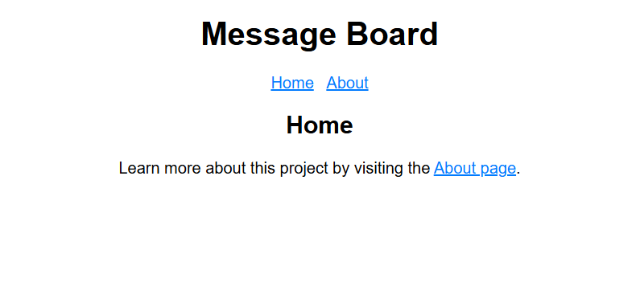

# flask_playground
This is a repository to create a simple Web Application with Flask.

The code is from the **RealPython** Blog  [**Build a Scalable Flask Web Project From Scratch, by Philipp Acsany **](https://realpython.com/flask-project/)

# Environnement
You can build a Docker Image, using the following command:
``bash build_docker_image.sh``

If you are not working with Docker Containers, you can just install Flask:
``pip install Flask``

# Run the web app
Use the following command:

``python -m flask --app board run --host 0.0.0.0 --port 8000 --debug``

